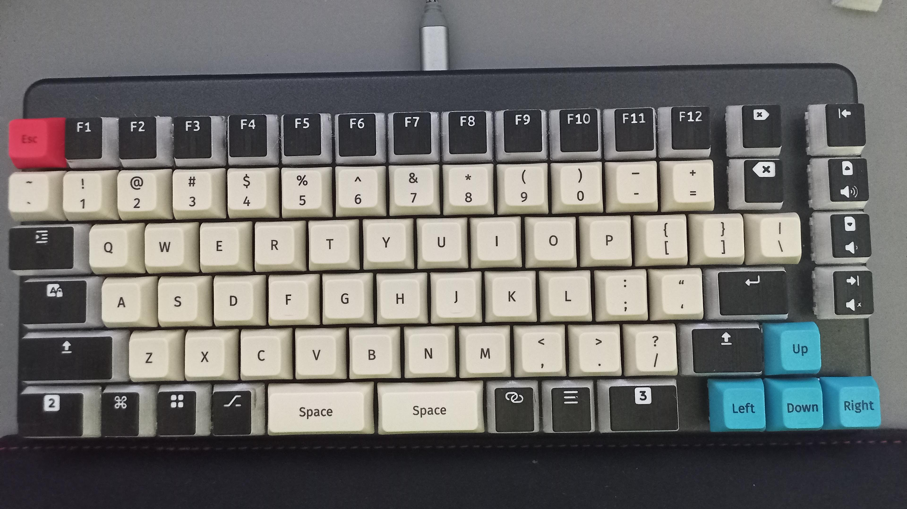

# keyboard

_**Custom keycaps and layout for my [System76 Launch](https://system76.com/accessories/launch) keyboard**_

Special keys, in a pudding style, for my Launch. These include:

* Caps Lock
* Shift
* Ctrl/Cmd
* Meta/Super/Windows
* Menu
* Alt
* Compose
* Layer 2
* Layer 3
* Enter
* Del
* Bksp
* Home + Play/Pause
* PgUp + Vol Up
* PgDn + Vol Down
* End + Mute

For standard alphanumerics & function keys... just buy yourself some pudding caps. I recommend [LTC's XDA-profile Lava Caps](https://www.amazon.com/LTC-LavaCaps-Translucent-Mechanical-Keyboard/dp/B09J1HMJV9).

## Tools

Keycaps generated using [`openscad`](https://openscad.org/) and [rsheldiii/KeyV2](https://github.com/rsheldiii/KeyV2), then post-processed in [TinkerCAD](https://www.tinkercad.com/things/bIolghDg7ja-keycaps) and sliced in [PrusaSlicer](https://www.prusa3d.com/page/prusaslicer_424/).

Iconography from [Font Awesome 6 Pro](https://fontawesome.com/).

## The current state of things

