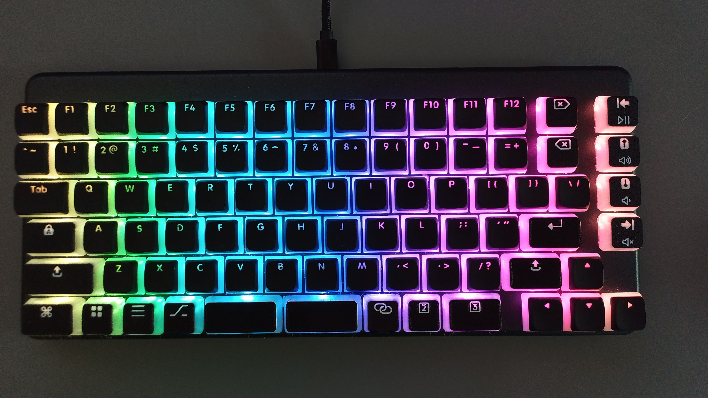

# keyboard

_**Custom keycaps and layout for my [System76 Launch](https://system76.com/accessories/launch) keyboard**_

Keycaps generated using [`openscad`](https://openscad.org/) and [rsheldiii/KeyV2](https://github.com/rsheldiii/KeyV2).

Iconography from [Font Awesome 6 Pro](https://fontawesome.com/).

## The current state of things

